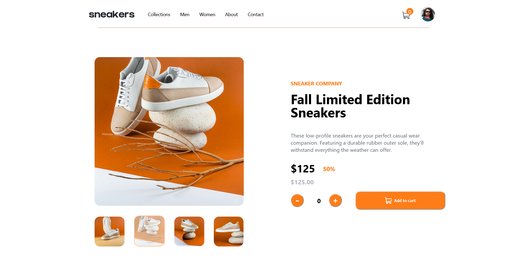

# Frontend Mentor - E-commerce product page solution

This is a solution to the [E-commerce product page challenge on Frontend Mentor](https://www.frontendmentor.io/challenges/ecommerce-product-page-UPsZ9MJp6). Frontend Mentor challenges help you improve your coding skills by building realistic projects.

## Table of contents

- [Overview](#overview)
  - [The challenge](#the-challenge)
  - [Screenshot](#screenshot)
  - [Links](#links)
- [My process](#my-process)
  - [Built with](#built-with)
  - [What I learned](#what-i-learned)
  - [Continued development](#continued-development)
  - [Useful resources](#useful-resources)
- [Author](#author)
- [Acknowledgments](#acknowledgments)

## Overview

### The challenge

Users should be able to:

- View the optimal layout for the site depending on their device's screen size (Currently only working for the desktop version)
- See hover states for all interactive elements on the page
- Open a lightbox gallery by clicking on the large product image
- Switch the large product image by clicking on the small thumbnail images
- Add items to the cart
- View the cart and remove items from it

### Screenshot



### Links

- Solution URL: [GitHub](https://github.com/Momzit/ecom-productPage-challenge)
- Live Site URL: [E-commerce-product-page](https://ecom-prod-page-fem.netlify.app/)

## My process

### Built with

- Semantic HTML5 markup
- CSS custom properties
- Flexbox
- CSS Grid
- [React](https://reactjs.org/) - JS library

### What I learned

I deliberatley used Context API and Redux so that I can solidify my knowledge of the concepts. I also learned how to use the useEffect hook. I always struggled to understand how it was used and why it was important. I finally had the opportunity to implement it on this project so that I am able to view lightbox when the large image is clicked. That is probably my proudest piece of code in all this project.

```js
useEffect(() => {
    setIndex(ind)
  },[ind,isOpen])
```
The above small piece of code saved me a whole lot of headache and frustration. 

### Continued development

The site is only complete for the desktop version, I still have to work on the mobile version, otherwise all logic and functionality that needs to be on the site is there. It is now a matter of more css and a few JavaScript here and there for the mobile version.

### Useful resources

- [Lightbox](https://itnext.io/create-a-simple-lightbox-in-react-2ef5facd1148) - This helped me in creating the lightbox component, great explanation and easy to follow.
- [Context and Redux](https://www.youtube.com/watch?v=RDV3Z1KCBvo&t=30598s&ab_channel=CleverProgrammer) - This video was the basis for understanding context api and redux, and made it easy to add and remove items from the cart.

## Author

- Website - [Moment](https://ecom-prod-page-fem.netlify.app/)
- Frontend Mentor - [@Momzit](https://www.frontendmentor.io/profile/Momzit)
- GitHub - [@Momzit](https://github.com/Momzit)

## Acknowledgments

Thanks to Kevin Van Ryckegem for the amazing article on creating a lightbox, the article saved my life :)